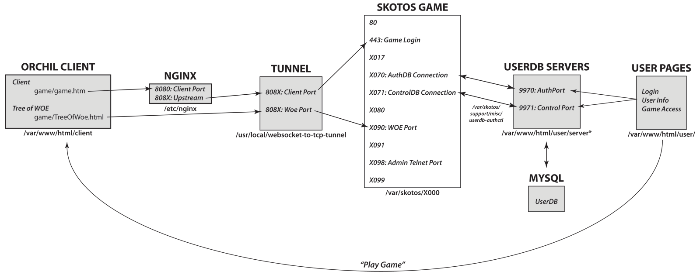

# SkotOS Maintenance

[](https://hackmd.io/ZsI7LFU4QOCFRYZFXN3JTQ)


This document describes the normal care and maintenance of a SkotOS instance



## Standard Files

We recommend the following standard setup for SkotOS files. The directories are options, the contents of `/var/skotos/XX00` are standardized in the SkotOS release.

   * /var/skotos: Directory for general SkotOS files
      * /var/skotos/XX00: Directory for an individual game that runs on base port XX00
         * /var/skotos/XX00/driver.log: File containing current error logs
         * /var/skotos/XX00/skoot: Directory containing main files for the game
            * /var/skotos/XX00/skoot/log: Directory containing all older logs
         * /var/skotos/XX00/skotos.database: File containing current game database
         * /var/skotos/XX00/skotos.database.old: File containing most recent backup of game database         
         * /var/skotos/XX00/skotos.dgd: File for configuration
     * /var/skotos/backups: Directory containing older backups of game database
     * /var/skotos/support: Directory containing miscellaneous files for Skotos
     
     
  * /usr/local/websocket-to-tcp-tunnel: Directory containing [tunnel](https://github.com/skotostech/websocket-to-tcp-tunnel) used by Orchil client
  
  
  * /var/www/html/[gamename] or /var/www/html/www: Directory containing WWW files related to game (e.g., your front page)
  * /var/www/html/client: Directory containing [Orchil Client](https://github.com/skotostech/orchil)
  * /var/www/html/images: Directory containing images used by clients
  * /var/www/html/user: Directory containing [thin auth server](https://github.com/skotostech/thin-auth)
     * /var/www/html/user/server-auth.php: One of the two servers that runs the UserDB. This one takes authentication commands
     * /var/www/html/user/server-control.php: One of the two servers that runs the UserDB. This one takes other commands
     * /var/www/html/user/userdb.php: The main library for functions in the servers
     
### Standard Crons

We recommend the following standard cronjobs, which use the above directory structure:
```
@reboot /var/skotos/runinstance.sh XX00 &
```
Start your game on reboot. This will result in a process like `/var/skotos/XX00/driver.run /var/skotos/XX00/skotos.dgd /var/skotos/XX00/skotos.database`. This will also fire up a piece of glue that attaches the game's ports to the UserDB's ports: ` /usr/bin/perl /var/skotos/support/misc/userdb-authctl XX00`. 
```
* * * * * /var/www/html/user/admin/restartuserdb.sh
```
This runs the two UserDB processes, `/usr/bin/php server-auth.php` and `/usr/bin/php server-control.php`. They depend on the `userdb-authctl` to talk with the game instance and together answer authentication and control requests to the UserDB.
```
@reboot /var/skotos/support/bin/flashpolicyd.pl --port=843 --file=/var/skotos/support/bin/crossdomain.xml 2>&1 < /dev/null > /dev/null &
23 4 * * * /var/skotos/support/bin/restartflash.sh
```
These processes keep the Flash client running. This will likely be irrelevent after 12/31/20, when Flash is deprecated.
```
@reboot /usr/local/websocket-to-tcp-tunnel/start-tunnel.sh
* * * * * /usr/local/websocket-to-tcp-tunnel/search-tunnel.sh
```
These are a vital component in the Orchil client, which flows through the HTML files in `/var/www/html/client` to `nginx` and from there to this tunnel, then the game. See the [Orchil repo](https://github.com/skotostech/orchil) for the full explanation.

```
* * * * * /var/skotos/support/misc/smtp-queue 8000
```
This keeps mail flowing from the game.

### Standard Backups

You should also have functions that regularly backup and store your database files, as you see fit. At Skotos, we kept the `old` database on hand and daily copied out an additional version to the `/var/skotos/backups` directory, where we maintained the most recent four backups. This was done with a program called `/var/skotos/support/misc/backup-dumps`, which also ran out of the cron:
```
40 9,17 * * * /var/skotos/support/misc/backup-dumps 8000
```
We also kept complete machine backups from one-day old, one-week old, and two-weeks old, and of course each of those had six copies of the database, resulting in somewhere around 20 backups available at any time (plus occasional snapshots)l.

## Starting SkotOS

A SkotOS game is usually started by a `runinstance.sh` script that runs the driver, using the appropriate `skotos.dgd` file and the appropriate database. Our standard script also initiates the `userdb-authctl` glue script and rotates the logs.

There are typically two `driver.run` scripts and one `userdb-authctl` script that are running afterward, along with the `runinstance.sh` script, which can be found by searching the process table for the port number:
```
# ps auxww | grep -i 8000
root       678  0.0  0.0  11712  1072 ?        S     2019   0:00 /bin/bash /var/skotos/runinstance.sh 8000
root      3221  0.0  0.0  12780   988 pts/0    S+   17:25   0:00 grep -i 8000
root     16248  0.0  0.0  26432  3772 ?        S    Apr29   1:58 /usr/bin/perl /var/skotos/support/misc/userdb-authctl 8000
root     22876 25.3 25.7 1044232 1037156 ?     S    Apr29 7684:14 /var/skotos/8000/driver.run /var/skotos/8000/skotos.dgd /var/skotos/8000/skotos.database
root     22877  0.0  0.0   2872   152 ?        S    Apr29   0:02 /var/skotos/8000/driver.run /var/skotos/8000/skotos.dgd /var/skotos/8000/skotos.database
```
If nothing is running, simply run `runinstance.sh` with the appropriate port number and they will all start.
```
# nohup /var/skotos/runinstance.sh XX00 &
```
The `nohup` prefix is improtant, because it will keep your `runinstance.sh` from quitting when you exit your shell.

If _some_ but not all of the processes are running, it's best to kill them (see below) and then restart.

## Killing SkotOS

If you simply need to restart a SkotOS game, deliver a kill signal to the two `driver.run` processes
```
# kill 22876 22877
```
They will shut down cleanly, and the `runinstance.sh` process will then restart them.

If you need to do something more extensive, such as shutdown the games prior to a move or shut down everything because the `userdb-authctl` glue has stopped running, then touch a file called `.shutdown` in the `/var/skotos/XX00` processes, then kill all of the `XX00` processes. Everything will shut down cleanly, and will _not_ restart.
```
# cd /var/skotos/8000
# touch .shutdown
# kill 22876 22877 16248
# kill 678
```
Wait for all the processes to close down, they restart with `runinstance.sh`
```
# nohup /var/skotos/runinstance.sh 8000 &
```

## Retrieving Backups

If your current version of a SkotOS game is corrupt, you can still go to an older version of the database.

After shutting down your SkotOS instance, copy the file and restart.

For example:
```
# cd /var/skotos/8000
# mv skotos.database skotos.database-THE-BROKEN-ONE
# cp skotos.database.old skotos.database
# nohup /var/skotos/runinstance.sh 8000 &
```
This makes a temporarily copy of your file (`skotos.database-THE-BROKEN-ONE`) but then moves your latest backup into place. Obviously, if it's working and you're OK with the rollback, you should then get rid of the broken version.

A similar technique could be used to use older backups stored elsewhere

(This should _almost never_ be required.)

## Restoring a Crashed Game

If a game has crashed and will not start up, the best thing to do is to retrieve a backup (see above) and then restart with the `runinstance.sh` script, for example: `nohup /var/skotos/runinstance.sh 8000 &`. Before doing so you should look and see if there are any remaining processes, and kill them.

## Adjusting Variables

From time to time, you may need to make adjustments to various variables in your SkotOS setup.

### Ports & Memory Sizes

Ports and various memorable variables can bef ound in `/var/skotos/XX00/skotos.dgd`. After adjusting the variables, you will then need to restart the game, which may be done by killing the `driver.run` processes and waiting for them to restart.

You might need to change ports if you're moving to a new machine or a new setup.

You might need to increase one of the memory variables if you're running up against the limit (which will usually generate errors).

### Other Variables

The other major variable storage in SkotOS is at `/var/skotos/XX00/skoot/usr/System/data`. The `instance` file has some more port info, plus the DNS name and `userdb` has info for connecting to the UserDB. These *should* instantly push their changes into SkotOS, but if not, restart the game.

### Finding What You Need

There's a LOT of stuff under `/var/skotos/XX00`. The best way to search for something is with a recursive grep:
```
# cd /var/skotos/3000
# grep -rn "www.skotos.net" .
```

## Accessing the Administrative Port

Each of the games has a "wiztool" port at XX98, which can be used to access a few low-level functions. You should *almost never* use this functionality, and you should be aware that you have the opportunity to totally cock up the game from here.

Access to the port is a two-step process.

1. Add the user to "System:Developers" in the Tree of WOE
2. Have someone with current admin-port permissions log in to the admin port and run `"code "~System/sys/devuserd"->set_password("name", "pass")`, where the `name` is their account name and the `pass` is a special password for admin port access.

Afterward, you can login with:
`telnet game-URL XX98`, for example `telnet game.lovecraftcountry.com 3098`.

**Don't do this unless you have a specific need and know what you're doing.**

### Recompliling Code

If you ever need to make a change to the DGD/LPC code, this is how you do it! YOu edit the file, and then you log in to the admin port and run `compile /path/name/under/skoot`

```
> compile "/usr/Theatre/sys/portal"
```
**Don't do this unless you really know what you're doing!**

### Adding SP Permissions

You can also run specific DGD/LPC code from the admin port by indicating a file name and a function.

A few specific functions will allow you to grant story-point-granting permissions to people:

This allows you to list current SP granters:
```
> code "/usr/TextIF/sys/storypoints"->query_accounts() 
$171 = ({ "alice", "bob" })
```
You can add people by referencing that return (`$171`):
```
> code "/usr/TextIF/sys/storypoints"->set_accounts($171 + ({ "charlie" }))
$172 = nil
```
You can similarly remove people:
```
> code "/usr/TextIF/sys/storypoints"->set_accounts($171 - ({ "bob" }))
$172 = nil
```
Or you could just bypass all of that and create a totally new list of people:
```
> code "/usr/TextIF/sys/storypoints"->set_accounts(({"charlie", "dan"}))
$172 = nil
```

## Renaming an Instance

If you ever want to rename your game instance's IP address, you can do the following:

1. Make sure you have the new DNS name in your DNS records. 
1. To make SkotOS recognize the new name:
   * Adjust the `hostname` line in `/var/skotos/X000/skoot/usr/System/data/instance`.
   * Restart the instance by killing the X000 processes.
   * It should restart on its own instantly.
   * Adjust the `hostname` record at `Theatre:Theatres:Gables` (or whatever your `Theatres` object name is) in the Tree of WOE
1. To make the UserDB recognize the new name:
   * Adjust the `gameURL` line in `/var/www/html/usr/config/general.json`.
1. To make the client recognize the new name:
   * Adjust the `server` line in `/var/www/html/client/profiles.js`.
1. To make the websocket tunnel recognize the new name:
   * Adjust the `host` line in `/usr/local/websocket-to-tcp-tunnel` for the game.
   * Adjust the `host` line in `/usr/local/websocket-to-tcp-tunnel` for the Tree of WOE.
   * Restart the tunnel by killing the `websocket-to-tcp-tunnel` process; use a `-9` if no one is longed on to avoid the wait (but otherwise wait).
   * It should restart on its own within a minute.
