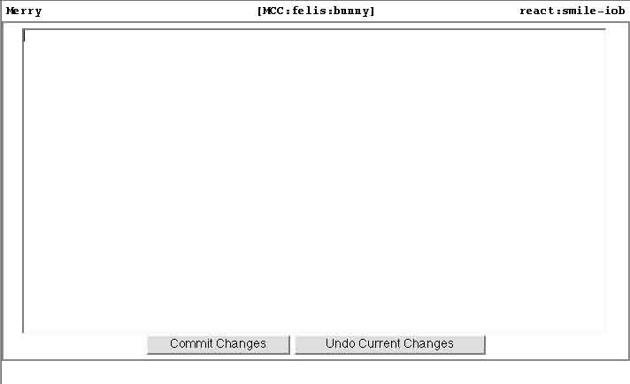
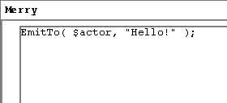
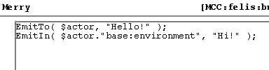
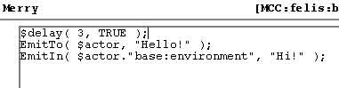
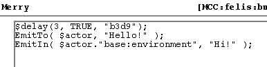
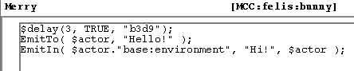
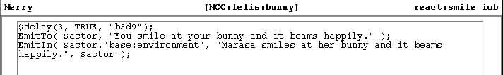

# Merry Crash Course Lesson #1

The step-by-step Walkthrough

12/15/02


-------

Kalle says, "Alright, those of you who's got woe powers, I want you to either 1) Go to MCC:bunny, duplicate it, and call it something like MCC:yourname:bunny .. or, grab an object you've made (simple, preferrably) and do the same with it. We will experiment with these."

> Go now and find the bunny, duplicate, rename 
>

Kalle briefly explains, "I'm gonna take this from the beginning. Explain basic stuff that some of you know already."

Kalle continues, "As I see it, there are two aspects to coding -- describing/building an object, putting looks/examines/briefs/snames/adjectives/etc. to it, defining bulk, etc. -- and putting scripts into it. Scripts being bilbo or merry snippets of code. This is, I believe, a fairly new thing at Skotos." 

Kalle says, "I've whipped together a pink stuffed bunny. We'll be using it (if you chose to use it), and will concentrate on the secondary aspect mentioned." 

Kalle explains, "A script can be when you take a drink of a beer. When you alter a garment's color, etc." 

Kalle adds, "Or when you smile at Wrenos." 

Kalle says, "So, let's spawn a copy of our object. Do that." 

Kalle's pink bunny arrives. 

```
> +spawn MCC:felis:bunny
StoryGuru Marasa's pink bunny arrives.
A spawn of a pink bunny has been created and teleported into your inventory
> 
```

Kalle says, "So, firstly, let's look at +tool." 

Kalle says, "Some of you are using zmud (telnet), which means +tool won't work well for you."

Kalle says, "We'll see how to deal with that. :)" 

Kalle says, "But, I want you to do this: +tool merry list %MCC:yourname:bunny." 

Kalle says, "E.g. +tool merry list %MCC:kalle:bunny."

```
> +tool merry list %MCC:felis:bunny
No Merry code found in MCC:felis:bunny.
> 
```

Kalle says, "For ease I will refer to your woe objects as %bunny. So any time I say %bunny, it means %MCC:yourname:bunny." 

Kalle says, "Or whatever you chose to call it." 

Kalle says, "Let's see if we can get an editor up (zmudders beware): +tool merry edit %bunny react:smile-iob." 

Yemalla says, "+tool merry edit %MCC:Yemalla:stuff react: smile-iob." 

Kalle tells Yemalla, "+tool merry edit %MCC:Yemalla:stuff react:smile-iob."

Kalle says, "Between react: and smile-iob, there should be no space."

Kalle says, "One word. :)"

Yemalla grins, "Got it."

Kalle smiles. 

```
> +tool merry edit %MCC:felis:bunny react:smile-iob <br>
Editing source in popup window.
> 
```

-----

-------

Kalle says, "Alright, let's type in one line here:" 

```
EmitTo( $actor, "Hello!" );
```

Yemalla says, "The middle line only, or the whole thing?" 

Kalle says, "Only the middle thing." 

Kalle says, "The EmitTo line."

Kalle says, "When you're done, Commit Changes."

-----

-------

Kalle says, "When it's done loading, try smiling at your bunnies."

```
> smile at my bunny
Hello!
> 
```

Kalle says, "Let's be really cute and explain that thing piece by piece."

Kalle says, "EmitTo -- EmitTo someone. A specific person." 

Kalle clarifies, "I.e. you can't use EmitTo to send a "Hello!" to a room." 

Yemalla asks Kalle, "So it's only to the person who uses the reaction?" 

Kalle nods to Yemalla, "This Hello! only goes to you. However, try smiling at my bunny." 

Kalle raises his pink bunny. 

```
> smile at kalle's bunny
Hello!
> 
```

Yemalla nods to Kalle, "okay."

Yemalla says, "Why is it not shown to all though.. or is that comming?" 

Kalle continues, "$actor -- The actor, person who is acting. Quite simple too." 

Kalle grins at Yemalla, "That is EmitIn. We will get to that. :)"

Kalle says, "Finally, "Hello!" which is the string to send. So, to conclude this: EmitTo( who, what )." 

Kalle says, "Let's be spammy and add an emit in the room whenever we smile at our pink friends." 

Kalle says, "So, in the popup ..." 

Kalle says, "Add a line under our EmitTo line:" 

```
EmitIn( $actor."base:environment", "Hi!" );
```

-----

-------

Kalle says, "Anyone with probs?"

Yemalla tells Kalle, "That is what I was talking about."

Kalle nods to Yemalla. 

```
> smile at my bunny
Hello!
Hi!
> 
```

> (People watching only see the 'Hi!' appear on their screens) 
>

Kalle says, "Okay, so we get a Hello!, and everyone gets a HI!."

Kalle says, "This one is a bit more complicated. Specifically, this: $actor."base:environment." 

Kalle continues, ".. may raise an eyebrow."

Yemalla says, "Base inviroment just means the current room, correct?" 

Kalle nods to Yemalla, "yes."

Kalle says, "EmitIn -- emit in a room." 

Kalle says, "\$actor."base:environment" -- The environment (room) $actor is located in." 

Kalle says, "Okay, so let's go back into our script and add a line on top. This one will look very odd at first, but it's quite simple." 

Kalle says, "At the first line, right above EmitTo, add:

```
$delay( 3, TRUE );
```

-----

-------

>  [Clicked 'Commit Changes' and then got:] 
>

-----

-------


```
> smile at my bunny
You smile at your pink bunny.
Hello!

Hi!
>
```

> (everyone else just sees StoryGuru Marasa smiles at her pink bunny. and then 'Hi!' with a delay, although they might not be aware of it)

Kalle explains, "A 3 second delay (wait). Also note that the actual smiling action is visible to you (and everyone else)."

Kalle says, "Sometimes you want the actual action to show. In other cases, you don't. For instance, in a secret switch you may want it to just say "Kalle does something odd to the west corner of the room." where I perhaps wrote "press fourth button thrice"." 

Yemalla asks Kalle, "what is the TRUE, "3364");" 

Kalle grins at Yemalla, "Was just coming to that. :)"

Yemalla says, "We didn't imput that... in the window.."

Kalle says, "$delay -- perform a delay." 

Kalle says, "3 -- the amount of seconds to wait."

Kalle says, "TRUE -- let the action go through! I.e. let everyone see me smiling at my bunny." 

Kalle says, "(if that had been FALSE instead, there would only be a wait, without the "You smile at your pink bunny.")" 

Kalle concludes, "And finally, merry automatically adds an identifier to all $delay cases." 

Kalle says, "This is one of those things you should ignore. It just happens." 

Kalle asks, "Any ?'s on $delay?" 

Yemalla asks Kalle, "How would you imput a false?" 

Kalle tells Yemalla, "replace TRUE with FALSE." 

Kalle says, "Case sensitive, so you can't type false, must be FALSE." 

Yemalla says, "hmm... not sure I see a difference." 

Kalle says, "The difference is that we no longer see "Yemalla smiles at her pink bunny." 

Yemalla nods to Kalle, "okay, thanks."

Kalle says, "The reason for this may be a bit unclear right now, but once you start coding things, you will realize why it works this way." 

Kalle says, "Let's look at the code again. Right now, we see "Hello!" and then we see "I will not grovel before Wrenos!". Or some of us do, anyway. The EmitIn command can have additional arguments on who should -NOT- see the emit. So, ..." 

```
change: EmitIn( $actor."base:environment", "Hi!" ); 
into:
EmitIn( $actor."base:environment", "Hi!", $actor ); 
```

-----

-------

Kalle clarifies, "Simply add , $actor before );"

```
> smile at my bunny <br>
You smile at your pink bunny.

Hello!
>
```

> (The room sees just the StoryGuru Marasa smiles at her pink bunny. and then the 'Hi!' with the delay, as before) 
>

Yemalla tilts her head, "But I didn't see the reaction." 

Kalle smiles at Yemalla, "Exactly!" 

Kalle tells Yemalla, "Which is the point." 

Yemalla says, "So the $actor cuts spam for you?" 

Kalle says, "Let's say this was about tweaking a torch to open a secret door. For the person tweaking, it could say "You tweak the torch and the secret door opens." and for everyone else it could say “Kalle does some odd thing and suddenly a door bounces in."

Yemalla shakes her head, "I don't see where this might be useful."

Kalle says, "The "Kalle does some odd thing" message should not go to Kalle, should it?" 

Kalle says, "Just as it says "You pause." for you, while it says "Yemalla pauses." for everyone else." 

Kalle says, "It would be odd and schizophrenic if it said both for you. :)" 

Kalle says, "And ugly." 

Yemalla nods slowly, "Okay." 

Kalle says, "Just for fun, change the messages: Hello! to "You smile at your bunny and it beams happily." 

Kalle says, "And change Hi! to "Yemalla smiles at her bunny and it beams happily."

-----

-------

```
> smile at my bunny <br>
You smile at your pink bunny.

You smile at your bunny and it beams happily.
> 
```

> Everyone else sees:

```
StoryGuru Marasa smiles at her pink bunny. <br>

Marasa smiles at her bunny and it beams happily.
> 
```

Wrenos says, "If I add quotes around labas it gives me an error message. Why?" 

Kalle tells Wrenos, "Because Merry thinks that the " indicates an end of the string. Try doing \"Labas\" instead." Hello! 

Yemalla asks Kalle, "Can you take a look.. getting errors now." 

Kalle says to Yemalla, "Okay, I am looking at your code..." 

Kalle says, "See the "You smile at ..." part?" 

Yemalla says, "merry parse error around line: 1."

Yemalla nods to Kalle.

Yemalla asks, "wrong spot?" 

Kalle nods to Yemalla, "Oh, can you copy the 1st line and quote for me?"

Yemalla says, "$delay(3, FALSE, "10e3");" 

Kalle nods to Yemalla, "Okay, this is a case of " without ending ". A line looks like: EmitTo( $actor, "lalalaa );" 

Kalle says, "Check over the quotation marks, and see if I'm correct." 

Yemalla nods to Kalle, "So I ned to close the quote?" 

Kalle nods to Yemalla, "Always." 

Steve mentions, "All parentheses need to match as well." 

Wrenos curiously asks, "Anyway I can get Oona to see "Wrenos' pink bunny scowls at you, but everyone else see Wrenos' bunny scowls at oona, but still react to my smile?" 

Kalle nods to Wrenos, "You can. But since Oona is a specific person, it may turn ugly. :) For instance, we can in a bit make a script where you extend your bunny to someone and the bunny would scowl at them when you did." 

Kalle says, "Keep your bunnies. If everyone wants it, I'll try to hold another one next week."

Kalle says, "Where we will give our bunnies more possessive abilities."

##### NEXT: Lesson 2